# How a CRUD statement flows through shardlite

The request-path and dynamic-scaling diagrams below describe the current code. New directories can
use the catalog-backed `init`/`join` path; legacy directories retain fixed modulo routing.

Key entry points:

- routing decision — [src/query/route.rs](../src/query/route.rs)
- hash → shard — [src/shard/routing.rs](../src/shard/routing.rs)
- the "just run SQL" path — [src/shard/mod.rs](../src/shard/mod.rs)
- ownership / forwarding — [src/net/forward.rs](../src/net/forward.rs), [src/cluster/placement.rs](../src/cluster/placement.rs)
- commit + replication — [src/shard/writer_fleet.rs](../src/shard/writer_fleet.rs), [src/replication/](../src/replication/)
- durable cluster catalog — [src/cluster/catalog.rs](../src/cluster/catalog.rs)
- catalog quorum and election safety — [src/cluster/catalog_quorum.rs](../src/cluster/catalog_quorum.rs), [src/cluster/durability.rs](../src/cluster/durability.rs)
- stable rebalance planning and fenced handoff — [src/cluster/rebalance.rs](../src/cluster/rebalance.rs), [src/cluster/promotion.rs](../src/cluster/promotion.rs)
- transfer and online split reconcilers — [src/cluster/transfer.rs](../src/cluster/transfer.rs), [src/cluster/split.rs](../src/cluster/split.rs)

---

## 1. The whole picture

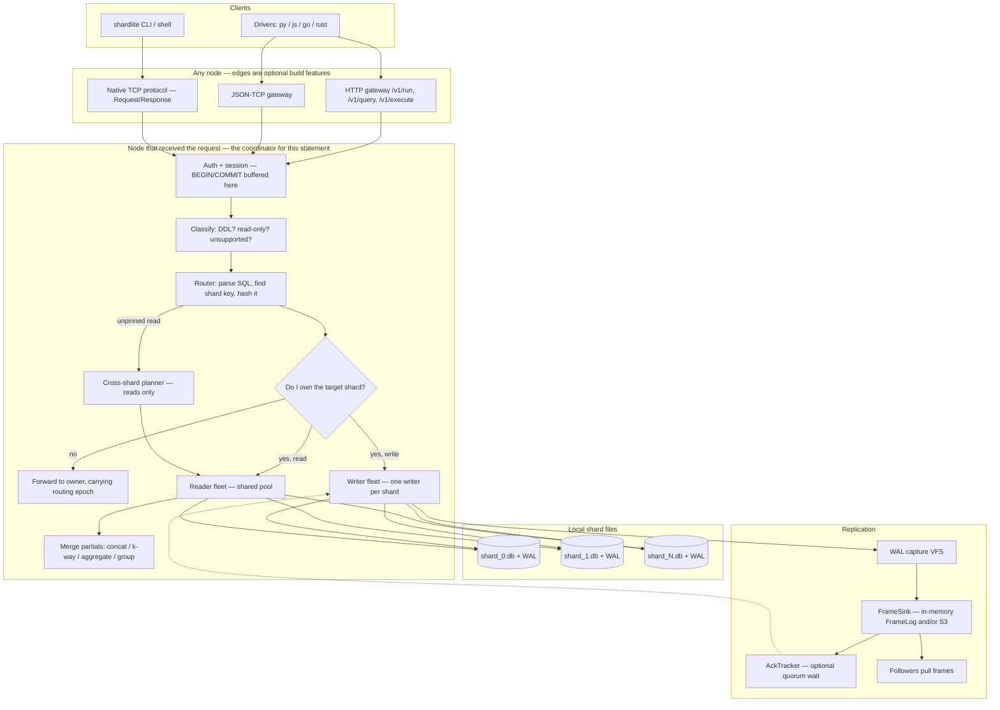

The rule that ties it together: **a client never names a shard**. It connects to *any*
node and runs plain SQL; the server does the hashing, the ownership lookup, the forwarding
and the merging. That choice is documented in `net/forward.rs` — pushing the placement map
into clients means a client with a stale map writes to the wrong node.

---

## 2. Sharding — how a row finds its file and its node

There are two independent mappings: **key → logical shard** and **logical shard → physical
copies**. Legacy directories use fixed modulo routing. Dynamic directories read `LinearV1` and its
epoch from the committed catalog; the same routing object drives INSERT, point CRUD, and fan-out
enumeration. Either the legacy placement calculator or the durable catalog controls the second.

```mermaid
flowchart LR
    K["Shard-key value<br/>e.g. users.id = 42"] --> B["Key bytes<br/>TEXT → UTF-8<br/>INTEGER → little-endian"]
    B --> H["FNV-1a 64-bit<br/>hash_key — frozen forever"]
    H --> R{"Routing scheme"}
    R -- "ModuloV1 — legacy directory" --> M["hash % fixed shard_count"]
    R -- "LinearV1 — dynamic directory" --> L["base = 2^level<br/>active = base + split_pointer"]
    L --> LH["first = hash % base<br/>if first < split_pointer:<br/>hash % 2×base"]
    M --> SID["logical ShardId"]
    LH --> SID
    SID --> PM{"Placement source"}
    PM -- "legacy static mode" --> LEG["derive round-robin from<br/>--peers + live membership"]
    PM -- "catalog-backed mode" --> CAT["committed ReplicaSet<br/>generation, primary, replicas"]
    LEG --> DB["owner opens shard_N.db + WAL"]
    CAT --> DB
```

Facts that matter when reading the diagram:

- The hash is a hand-written FNV-1a, *not* `DefaultHasher`, because a hash change would
  silently re-route every key — indistinguishable from data loss.
- `ModuloV1` is the shipped CLI behavior: `shard_count` is fixed at creation, recorded in
  the manifest, and a mismatch is refused.
- `LinearV1` stores `(level, split_pointer)` and grows by one logical shard at a time. A
  growth step splits only `split_pointer` into that shard and `base + split_pointer`; keys
  in other source shards retain their logical shard. SQL forwarding carries the routing epoch,
  so a stale coordinator is refused across cutover rather than writing to the old route.
- The **shard key** is either declared explicitly, or adopted automatically from a
  single-column `PRIMARY KEY` when the `CREATE TABLE` is applied — and every node adopts it
  from the same DDL text, so all nodes compute the same route.
- Shard-key updates are refused even when a caller explicitly names a physical shard; moving a row
  between files cannot be made atomic by bypassing the router.
- Legacy placement is derived from static peers and liveness. Catalog-backed placement is
  durable replicated state: each shard has an ownership `generation`, one `primary`, and
  zero or more `replicas`. `ClusterNode` can read this committed map instead of recomputing
  assignments. `shardlite init` and `shardlite join` select this dynamic path; opening an old
  manifest continues to use legacy behavior.
- Heartbeats distribute the current view; they do not decide a catalog change in the CRUD
  write path.
- Within a node, shard → writer thread is `shard_id % writer_threads`, so every shard still
  has exactly one writer while thread count stays bounded.

---

## 3. The routing decision — the same one for C, U and D

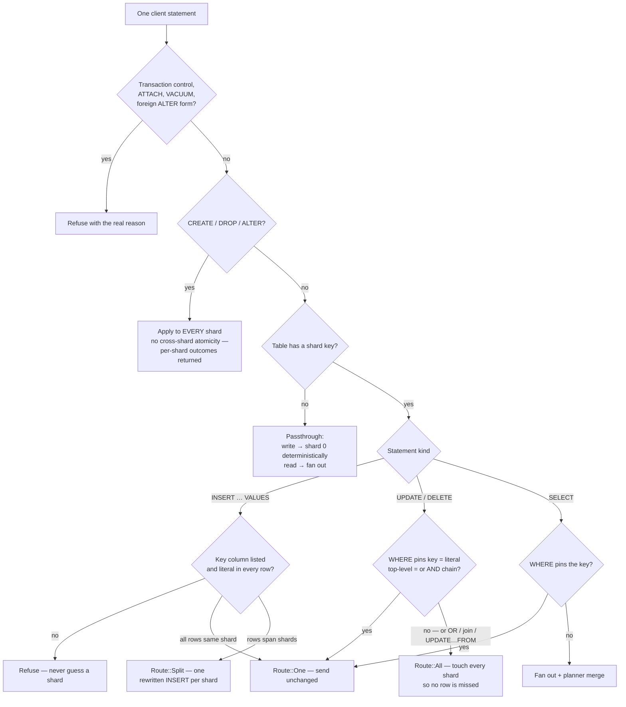

`OR` is deliberately not descended: it can match rows on more than one shard. An `INSERT`
whose shard key is missing or non-literal is **refused** rather than sent somewhere
plausible — otherwise every keyless write lands on shard 0 and the cluster behaves like a
single database.

---

## 4. CREATE / INSERT — the write path end to end

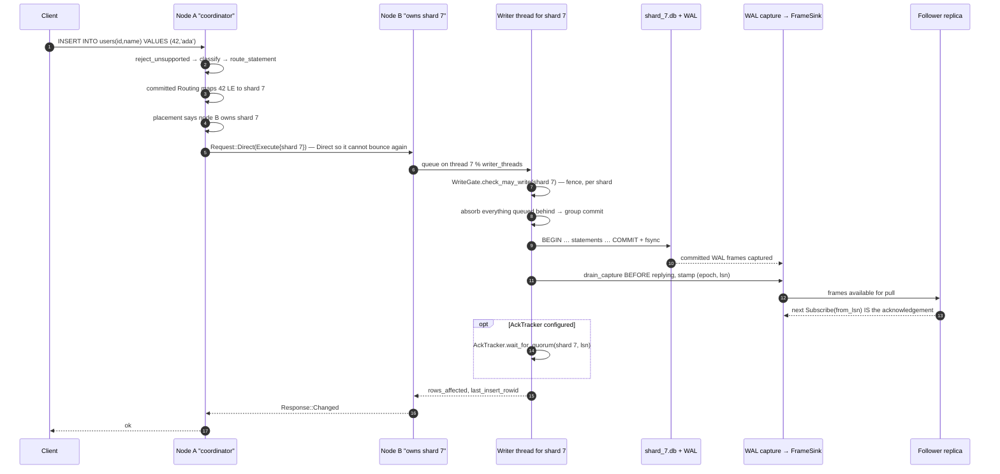

Four ordering decisions in that sequence are load-bearing:

1. **Gate before the transaction, not after.** A deposed leader must not commit at all.
2. **Drain to the sink before replying.** A caller told "ok" must never hold a write the
   sink never received.
3. **When quorum acknowledgement is configured, wait before replying.** Otherwise a leader
   that dies in that window has acknowledged a write no future leader holds. A timeout is
   reported as exactly what it is — *committed locally, replication unconfirmed* — never
   as a plain failure, because a client that retried would double-apply. Without an
   `AckTracker`, the durability boundary is the local commit plus sink drain.
4. **One wait per batch, not per write.** Group commit amortises the round trip, so the
   per-write quorum cost *falls* as load rises.

`CREATE TABLE` differs only in fan-out: it goes to every shard, and each node that applies
it adopts the table's single-column primary key as that table's shard key.

---

## 5. READ — point read vs. cross-shard fan-out

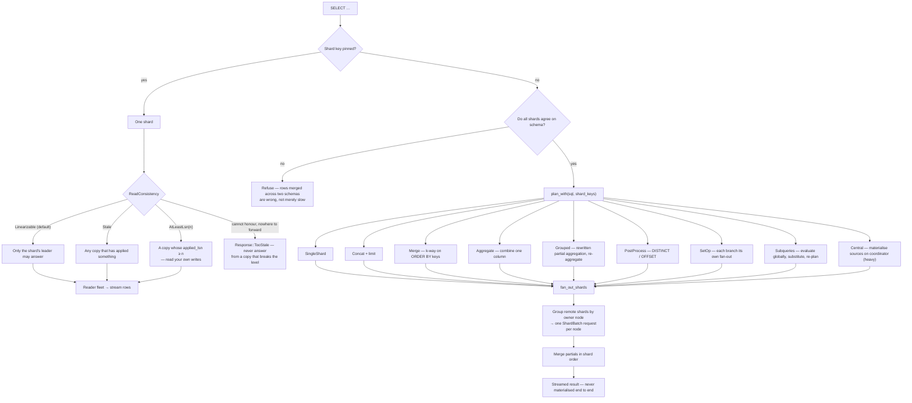

Note what a fan-out costs: **one request per node**, not one per shard. And a cross-shard
read is explicitly *not* a consistent snapshot — each shard's partial is its own latest
committed state.

---

## 6. Replication — what a follower does with the frames

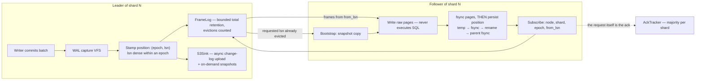

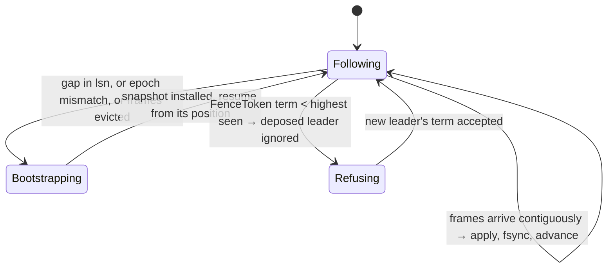

Why physical replication, and why this ordering:

- A follower **writes pages, never SQL** — non-deterministic functions and per-machine
  errors cannot make it diverge, because it evaluates nothing.
- **Pages first, position second.** A crash in between replays some transactions, which is
  harmless: writing the same page twice yields the same page. Position-first would silently
  skip transactions — undetectable corruption. The position itself is written to a temporary
  file, fsynced, renamed, and followed by a parent-directory fsync.
- **Epoch exists because density cannot survive an unclean restart.** LSN 900 in epoch 4 is
  not "ahead of" LSN 5 in epoch 5; they are not on the same ruler, so a cross-epoch
  comparison is `Incomparable` and a vote is refused rather than approximated.
- A follower's next `Subscribe(from_lsn)` *is* its acknowledgement — there is no separate
  ack message to lose or reorder.
- Bootstrap freezes the main file by **suspending checkpointing**, so the bytes being copied
  cannot change underneath the copy.

---

## 7. Safety rails around all of it

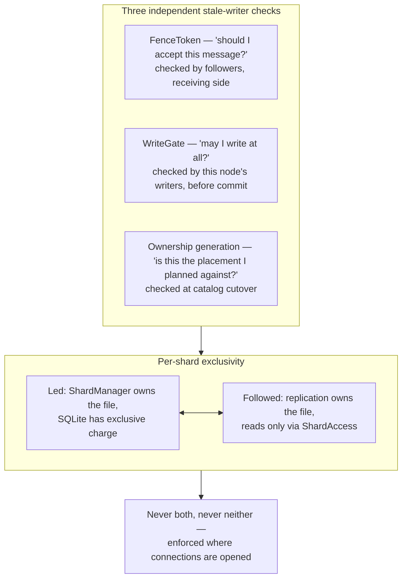

A node **leads some shards and follows others** — that is what multi-write means. So both
the gate and the shard mode are per shard; a node-wide flag would let a node that leads any
shard write every shard. On a followed shard, cached read connections carry a generation
that every apply bumps, so a stale page cache or a handle to a replaced inode is closed and
reopened rather than silently serving frozen rows.

---

## 8. Dynamic scaling control plane

This control plane is deliberately outside the request path. Dynamic CRUD reads the committed
catalog routing and placement, while slow durable reconcilers move or split one shard at a time.
The local manifest is an allocation ceiling (currently at most 256 files), not the number of active
logical shards; inactive files are created lazily.

### Catalog membership and agreement

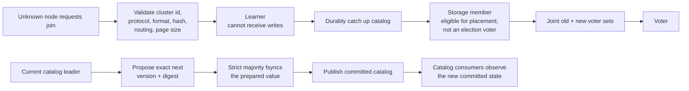

Catalog state contains:

- a stable cluster ID and compatibility contract;
- versioned `Routing`;
- members with `Learner`, `Storage`, or `Voter` roles and `Active`, `Cordoned`, or
  `Draining` states;
- per-shard replica sets with an ownership generation;
- operation records that can represent `Join`, `Transfer`, `Split`, `Drain`, and `Remove`.

A catalog value is chosen only after a strict majority has fsynced the exact proposal. During a
voter change, both the old and new sets must independently have a majority. Prepared values survive
a timeout and can be retried or recovered by a new leader. Election durability includes the latest
catalog version and digest, so a candidate behind the catalog—or claiming a different value at the
same version—cannot win and forget a chosen topology.

### One fenced primary transfer

```mermaid
stateDiagram-v2
    [*] --> Planned
    Planned --> Snapshotting
    Snapshotting --> CatchingUp: install snapshot at exact epoch / LSN
    CatchingUp --> Prepared: destination reports durable progress
    Prepared --> Fencing
    Fencing --> Fencing: source gate closed; queue drained; final LSN recorded
    Fencing --> Committed: destination durable through final LSN; generation + 1
    Committed --> Cleaning
    Cleaning --> Complete
    Planned --> Aborted
    Snapshotting --> Aborted
    CatchingUp --> Aborted
    Prepared --> Aborted
```

The cutover boundary is precise:

1. Bootstrap the destination with a snapshot and continue WAL catch-up in the same stream epoch.
2. Close only the source shard's write gate and drain its writer queue.
3. Record the source's exact final `(epoch, LSN)`.
4. Require the destination to report that LSN **durable**, not merely received.
5. Atomically change the committed primary and increment its ownership generation. The old
   primary remains a replica through this boundary.
6. Clean up and complete. Before commit the operation may abort; after commit recovery must
   roll forward.

The rebalance planner preserves existing assignments, proposes at most one transfer at a time,
evacuates cordoned or draining nodes first, and prefers a destination that is already a replica.
If there are fewer active shards than eligible storage nodes, it returns `NeedsSplit`: moving an
existing shard would only change which node is idle, not add a write lane. The leader starts a split,
then resumes whole-shard balancing after it completes. A late storage node receives the latest
catalog snapshot before its transfer worker acts.

### One online logical split

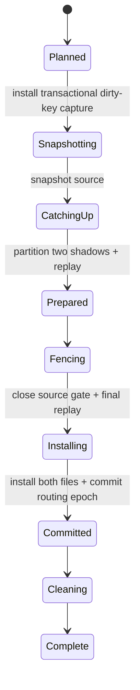

The source stays query-visible while two hidden copies are partitioned. Per-table triggers write
typed dirty primary keys in the same user transaction. Replay reads the resulting row from the
source instead of re-running SQL, so `random()`, time functions, and user-trigger effects are
preserved. User triggers are disabled while shadows are reconstructed and restored before install.
Only the source shard is fenced for final convergence; unrelated shards remain writable. The two
images are installed before the new routing epoch is quorum-committed, and staging markers make an
interrupted install/cleanup roll forward.

The current split preflight intentionally accepts only tables whose declared shard key is their
single-column `PRIMARY KEY`, with text or integer values. It refuses virtual/keyless/composite-key
tables and refuses a source placement with replicas until every replica can acknowledge both shadow
installs. Phase-by-phase process-exit/restart qualification is implemented and verifies automatic
roll-forward with complete row comparisons. Capture-log bounds/backpressure, partitions, disk
faults, and continuous concurrent workload qualification remain production-hardening work; see
[crash-recovery.md](crash-recovery.md) and
[dynamic-scaling-plan.md](dynamic-scaling-plan.md).

### Operator surfaces

- `shardlite init` creates a small linear-routing cluster; `shardlite join --seed ...` durably joins
  a learner and completes it as non-voting storage.
- The leader automatically performs one split/transfer at a time after capacity joins.
- Quorum-backed HTTP mutations cover rebalance, member cordon/drain/removal, and begin/finalize
  voter changes.
- The console proxies those mutations, shows active operations, routing epoch, logical shard count,
  local allocation capacity, and joint voter state.

---

## What this design does not do

Straight from the README and the module docs, so the diagrams aren't read as promising more
than they deliver:

- **No cross-shard transactions.** A transaction is scoped to one shard.
- **No consistent cross-shard snapshot.** A fan-out read gathers per-shard latest states.
- **DDL is not atomic across shards.** Per-shard outcomes are returned rather than collapsed
  precisely because a partial failure leaves shards disagreeing.
- **A hot single row is a hot single shard.** Sharding does not help a workload concentrated
  on one key.
- **Legacy shard count stays immutable.** Existing modulo directories cannot be converted in place.
- **Dynamic growth currently stops at the local 256-file allocation ceiling.** Logical activation
  starts small, but raising that implementation ceiling still requires a format/runtime change.
- **HA logical split is not enabled yet.** Whole-shard moves retain replica-count semantics, but a
  split source with replicas is refused until per-replica shadow install acknowledgement exists.
- **A split has schema limits.** Every table must use a declared single text/integer primary shard
  key; virtual, keyless, and composite-key tables block it.
